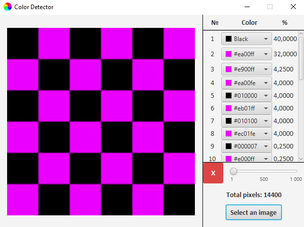

# ColorDetector
## GUI

## Idea
  The main idea is to analyze the input image to get information about the colors and their amount in % in this image
##  MVP Scope
  As a user, I want to select an image on the computer and get each color as a percentage of the image's total pixels
## How it works
  Based on MVP Scope, we can specify next behaviors:
   * User can select an image on the computer
   * User can select the amount of required information (up to 1000 pcs.) on the screen
   * User can reset the program to its starting point by pressing clear "X" button
## Technological stack
   * SpringBoot as a skeleton framework
   * JavaFX Weaver starter
   * JavaFX for GUI
## License
  This project is **Apache License 2.0** - see the [LICENSE](https://github.com/VladyslavBabenko/ColorDetector/blob/master/LICENSE) file for details
